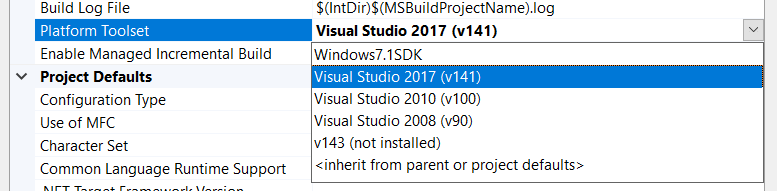
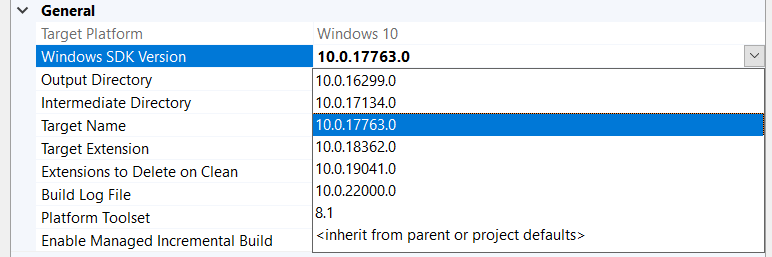
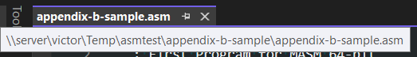
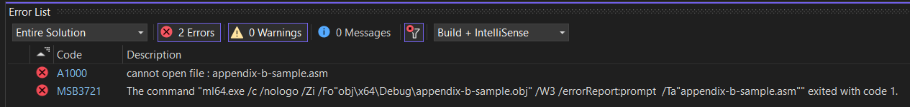
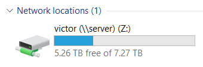
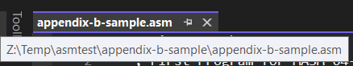

# Examples Repo

This repository contains various examples used throughout the course. Some examples contain Visual Studio projects and are included as part of the `CPSC215-Examples.sln` solution. Other examples are standalone files.

## Visual Studio

To run the Visual Studio examples:

- Open the `CPSC215-Examples.sln` solution.
- Find the project you want to run in the Solution Explorer.
- Right-click the project and click `Set as StartUp project` ([screenshot](screenshots/startup-project-selection.png)). The startup project will be bold in the project list.
- Set a breakpoint in an appropriate location, as desired.
- Press the `F5` key to build and debug the project. You can also click the green play icon in the menu bar, or click `Debug` -> `Start Debugging` in the top menu.

### Platform Toolset

The solution is configured to use Visual Studio 2022 and the Windows 10 SDK. If you are using a different version of Visual Studio (for example, the computer labs have 2017 installed), you must reconfigure a project to use the correct version of Visual Studio.

- Open the solution in Visual Studio.
- Right-click on a project in the Solution Explorer and click `Properties` ([screenshot](screenshots/opening-project-properties.png)).
- Go to the `General` properties section (first section in the list) ([screenshot](screenshots/general-project-properties.png)).
- Change the `Platform Toolset` property to the version you have installed.

### Windows SDK Version

Visual Studio 2017 also seems to prefer an explicit Windows SDK version. Pick one of the `10.0.x` versions that are installed on the machine using the `Windows SDK Version` property on the same page. The specific version does not matter.

### C++ Toolset

If Visual Studio is unable to open the projects and you see a "Install Missing Features" dialog, you need to install the C++ development toolset using the Visual Studio Installer ([screenshot](screenshots/missing-cpp-tools.png)).

### Running on Network Share

You may encounter issues running a project that is stored on a network share.

In this case, you must mount the network share as a drive or move the repository to a local disk.

