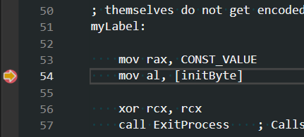
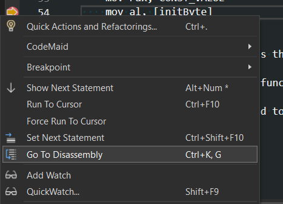
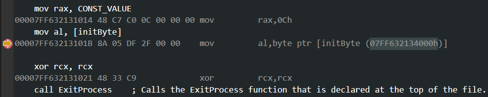
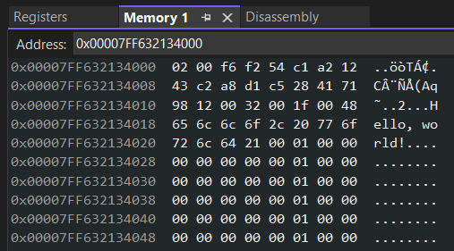

# Assembly Basics

## Inspecting Memory

You can examine the memory contents created by the data definition directives in the data segment at runtime.

- Set a breakpoint at the line `mov al, [initByte]`.

- Right-click and choose `Go To Disassembly`.

- In the disassembly window, you will find the corresponding instruction, along with the address of the variable `initByte`.

- Copy the address.
- Open the memory debug window. From the top menu, choose `Debug` -> `Windows` -> `Memory` -> `Memory 1`.
- Paste the address of the variable `initByte` into the address bar and press enter.

Now you can inspect the contents of memory generated by the data definition directives. Play around with different directives and initial values and observe the results.
