# Reverse Engineering - Example 1

In this example you will reverse engineer the executable `re-example-1.exe`. The source code for the executable is provided in the `src` directory. The provided executable was built using this source code in `Release` configuration for the `x64` platform. You should pretend this source doesn't exist and attempt to reverse engineer the provided executable as if you did not have the source code available.

The documentation below serves as an introduction into the basic functions of the IDA disassembler/debugger.

## Getting Started with IDA

### Setup

Install [IDA Free](https://hex-rays.com/ida-free/) and launch the program.

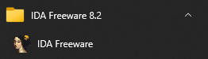

When IDA launches, the Quick Start window will appear. Click `New` to start a new project.

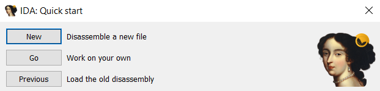

A dialog will appear to load an executable file. Find and open `re-example-1.exe`. After opening the file, another dialog will appear as shown below.

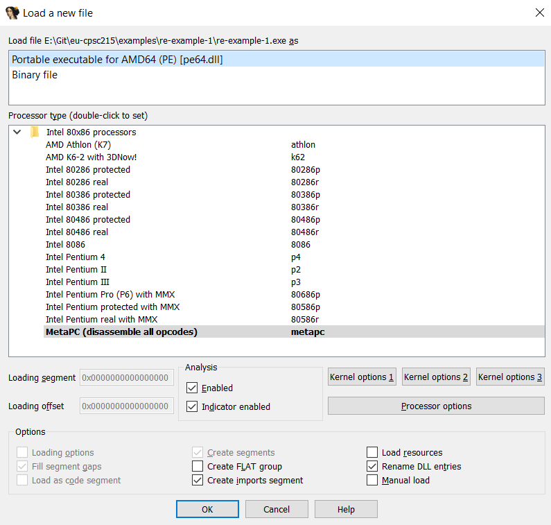

You can use the default values and click `OK` to finish loading the file.

### Debug Symbols

IDA will tell you the input file was linked with debug information. For this example, click `No` to not load the debug symbols.

Debug symbols provide a debugger with details about the original source code, such as function and variable names, source file names, line numbers, etc. This metadata is extremely valuable when debugging a program, since you can correlate machine instructions back to the high-level source where it originated. When a program is compiled for final release to the consumer, debug symbols are usually omitted, since they provide no value to the normal user.

When you've finished going through this example, you can come back and repeat the exercise and choose `Yes` to load the debug symbols. You will first need to load the Visual Studio solution in the `src` directory and compile the program in the `Release` configuration. Then, IDA can utilize the debug symbols.

### IDA View

After IDA loads the executable, it will automatically analyze it. You can now use the various IDA windows to inspect and explore the executable. Inspecting an executable while it is not running is called _static analysis_.

There are various windows open by default, and you can switch between them using the tabs at the top of the screen.

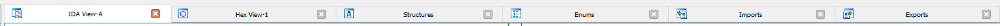

The first window you'll see is the `IDA View` window. This displays the instructions of the program in a graph view. The instructions are broken up into _basic blocks_. A basic block is a sequence of instructions with exactly one entry point (the first instruction) and one exit branch (the last instruction). When viewed in graph form, this helps visualize the flow of the program.

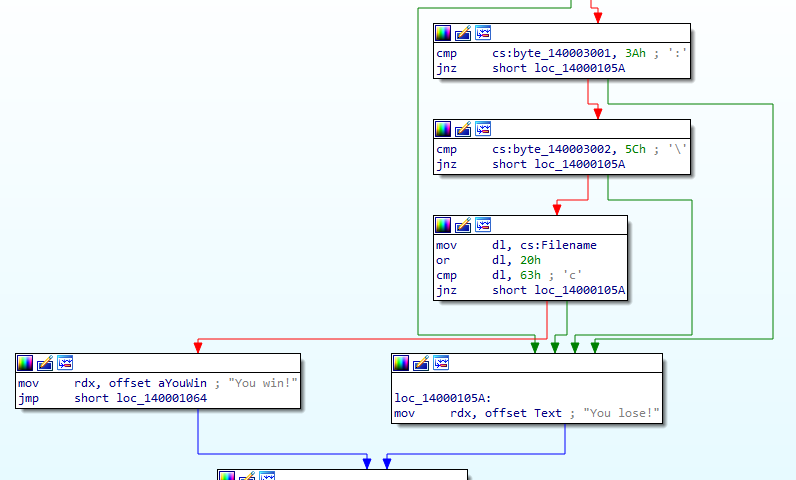

While inside the graph view, press the spacebar key on your keyboard to switch between graph view and disassembly view. The disassembly view shows the disassembled instructions in the order they appear within the program.

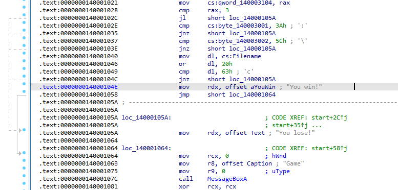

Press the spacebar again to switch back to graph view.

#### Comments

One thing you'll notice is that IDA adds a lot of additional comments and metadata about the program based on the analysis it performed after loading the executable.

For example, IDA detected a function call to `GetModuleFileNameA`. It automatically puts the symbol name of `GetModuleFileNameA` in the disassembled `call` instruction. It also detected the parameters being passed into the function and put comments with the name of the parameter next to the relevant instruction.

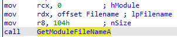

You can put your own comments in the disassembly. Click on the line you want to comment on and press the `;` key on your keyboard (alternatively, right-click on the line you want to comment on and choose `Enter comment`). Type in your comment and click `OK`.

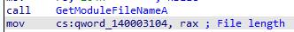

#### Identifiers

Since we don't have debug symbols loaded, we don't know what the original variable names were. However, IDA will assign a variable name for us. Sometimes it uses a human-friendly name if possible. For example, IDA detects there is a filename string buffer provided to `GetModuleFileNameA`. Since knows the parameter names of the function, it decides to name the variable `Filename`.

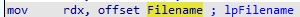

Sometimes IDA can't determine a name for a variable or label, so it assigns one based its address. Below is an example of a label being used by a conditional branch instruction. IDA assigns a label name with a prefix of `loc_` followed by the address of the label.

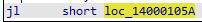

You can override the auto-generated names with your own. Right-click on an identifier and choose `Rename` (or press `N` on your keyboard). Enter a name and click `OK`.

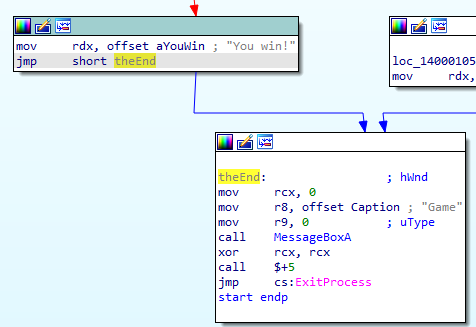

#### Strings

IDA tries to interpret strings and characters. In the screenshot below, IDA adds a comment with the ASCII interpretation of `3Ah` next to the instruction as a clue this might be an ASCII character. There's no _guarantee_ that the program is using this value as an ASCII character, but the comment is useful and indicates the possibility to us.

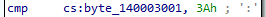

Another example is shown below where IDA detected a hard-coded string variable. It assigned a variable name based on the string contents and put a comment next to the instruction to show us what the value of the string is.

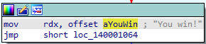

#### References

Clicking or selecting identifiers or text within the IDA View will highlight other instances of that text. If you double-click on an identifier, the IDA View will navigate to the location where that identifier is defined or the address it refers to. For example, `loc_14000105A` is referenced in multiple locations. Double-clicking on that identifier will automatically navigate the view to the address it references.

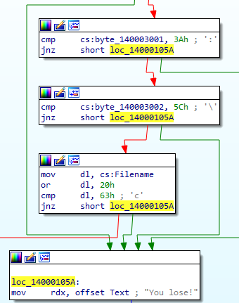

With an identifier highlighted, you can press the `X` key to bring up the cross-reference ("xrefs") dialog. This shows all the places within the program where that identifier is referenced.

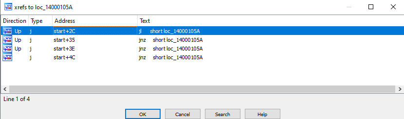

#### Branching

The graph view draws arrows that represent the control flow of the program.

- A green arrow indicates a conditional jump that is executed.
- A red arrow indicates a conditional jump that is not executed.
- A blue arrow indicates an unconditional jump or a continuation of consecutive instructions (no jump).

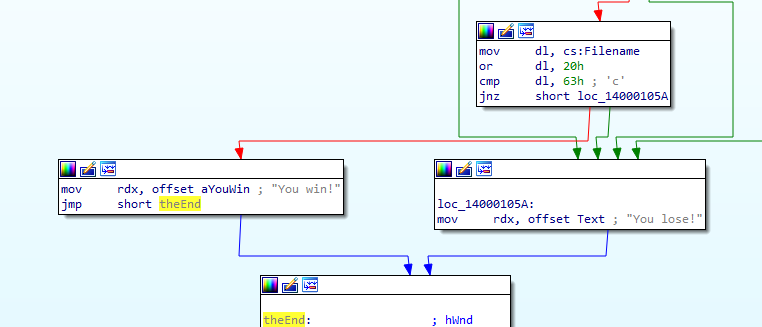

### Hex View

The `Hex View` shows the contents of the program in hexadecimal form. This appears as a standard hex-editor view, with a three column layout: an address column, then a column with the contents of the program in hex, and a column with the interpretation of the data as ASCII characters.

### Imports

The `Imports` window shows external symbols being imported into the program. It is common to see Windows API functions being imported from system DLLs.

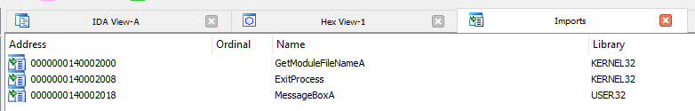

Here we see three functions being imported by the program we are reverse engineering. The imports table can provided insight into what type of operations a program is doing. For example, if a program is reading or writing files, you can usually find a corresponding API function being imported.

### Strings

Another useful window is the `Strings` window. If the strings window is not open, go to the top menu bar and choose `View` -> `Open subviews` -> `Strings`. When IDA analyzes a file, it tries to find valid text strings within the program. The strings window will list the strings it found, along with its address in the program and other details. Sometimes IDA may detect a string that isn't really a string, in which case the contents will look nonsensical.

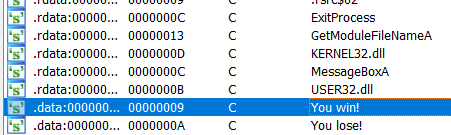

Strings are another useful tool when trying to get insight into what a program is doing. You can use string references to identify certain portions of code or help determine the purpose of certain functions. Often a program shows strings to a user in some capacity, through a user interface or console output. Strings may be left in a program as a remnant of debugging or logging messages. These can be helpful clues when reverse engineering.

### Functions

The `Functions` window shows a list of functions that IDA detected in the program. If IDA cannot detect a function name, it will automatically generate a name for it, similar to the label example we saw earlier.

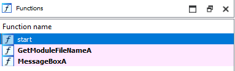

### Program Segments

At the top of the IDA program window, just below the toolbar, is a bar indicating how the program is divided up and the associated program segments. You can click on any portion of this bar and IDA will navigate to that line of the program file. Hovering over the different segments of the bar brings up a tooltip showing the name of the program segment and its address.

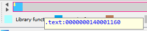

If you navigate to the beginning of a segment, you will see additional details about the segment that IDA was able to identify.

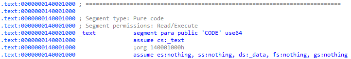

### Saving and Loading

Click the save icon in the toolbar or use the main menu option `File` -> `Save` to save your IDA project database. This will save any comments, notes, names, etc. that you have made. Any analysis done by IDA is also saved in this database. Note that `Ctrl` + `S` is **not** the default keyboard shortcut for saving.

When you have an IDA project open, the project database is unpacked into a number of files in the file system.

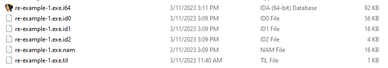

When you close IDA, it will ask you if you want to save pack the database. Choose the default option `Pack database (Store)`.

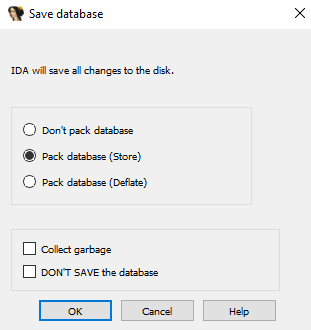

This will pack the project database files back into a single file.

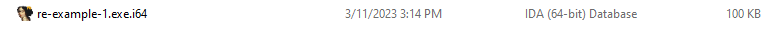

When you re-open IDA, you can choose to continue working on an existing project from the list of recent project, or manually open the database file to continue where you left off.

## Debugging

Static analysis can reveal quite a bit about a program, but running the program and observing its behavior brings even more information about what a program is doing. This is called _dynamic analysis_. During dynamic analysis, we can inspect data in memory, register values, stack values, etc. with real data. We can set breakpoints at certain locations in code, or even set breakpoints to tell us when portions of memory are written to or read from.

IDA is not just a disassembler, but also a debugger. To launch a program and debug it, click the green play icon in the toolbar, or choose the `Debug` -> `Start process` menu option.

IDA will warn you about running the program. It is important to only execute programs you know are safe and not malicious. If you are analyzing a program of suspicious origin or a program you think may be malicious, you should be very careful about where you execute that code. In the case of malicious code, a sandboxed virtual machine with limited or no network connectivity can be used to execute and debug the program without the risk of compromising your own hardware or network.

For this example, the program we are debugging is safe to execute on your own machine.

You can set breakpoints within the program using the `IDA View` window. Click on the instruction you want a breakpoint at and press the `F2` key to toggle a breakpoint on and off.

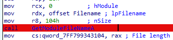

When you debug the program, IDA switches the UI layout. Go to the `IDA View` tab to see the breakpoint. When in the `IDA View` window, you can press the spacebar to switch between graph and text views. You can then use standard debugging controls in the `Debugger` menu to control execution of the program. Some useful keyboard shortcuts are:

- `F7`: Step into
- `F8`: Step over
- `Ctrl` + `F7`: Run until return
- `F9`: Continue process

The registers window lets you inspect the value of registers and flags and even changes their values.

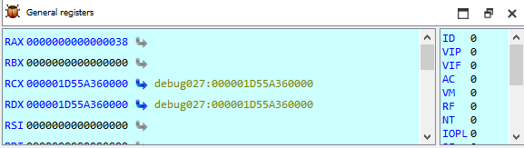

As you step through the instructions of the program, you can observe the changes in registers and memory. When you reach a conditional branch instruction, IDA will flash the graph arrow indicating which whether the jump will be executed or not.

## Reversing

You should now be able to utilize IDA to reverse engineer the example program and figure out what it is doing.