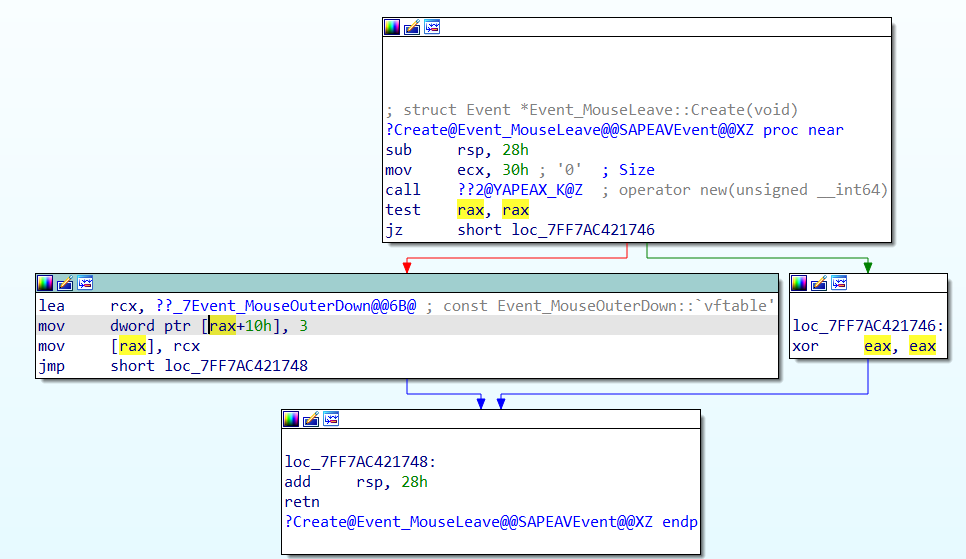

# Minesweeper Hooking

This example expands on the previous Minesweeper example. Instead of preventing the user from clicking on a mine, what if we could show the user when they are hovering over a mine?

There are a few things to figure out:
- How the game stores the data about tiles and how it tracks if a tile has a mine.
- How the game handles input events so we know when a tile is being hovered over.
- How to execute our own drawing commands to render on top of the Minesweeper window.

This example uses DLL injection and function hooking to modify the game instead of directly editing the executable. These techniques are more advanced and beyond the scope of this course, but they are included here to show interesting examples of what can be done.

Below are some notes for this example. It is not an exhaustive tutorial, but should provide additional insight as you read through the example code. When reversing engineering a program, things are not always so obvious. A lot of trial-and-error and experimentation are required. Much of the thought process used to develop this example has been streamlined and omitted for the sake of brevity.

## Reverse Engineering

### Mine Data

First, we need to understand how the game stores data about where mines are located. This will require some reverse engineering work. Let's start in `Board::AttemptReveal()`.

IDA shows us the signature of this method:

```
; __int64 __fastcall Board::AttemptReveal(Board *__hidden this, int, int)
```

- The first parameter is the `this` parameter. When dealing with programs written in C++, class instance methods take a pointer to the instance of the object as the first parameter. In C++ code, this parameter is implied; you only pass in the remaining two parameters of the method and the `this` pointer is handled by the compiler: `board->AttemptReveal(0, 1)`.
- The second and third parameters are two integers, which after further investigation are revealed to be a column index and a row index, indicating where on the board to attempt a reveal.

From the previous example, we know where the code checks if a tile has a mine or not:

```
loc_7FF7AC4072BA:
1️⃣ mov     rax, [rcx+58h]
2️⃣ mov     rcx, [rax+10h]
3️⃣ mov     rax, [rcx+rbp*8]
4️⃣ mov     rcx, [rax+10h]
5️⃣ cmp     [rsi+rcx], dil ; RSI is index of row. RCX is ptr to array of bool indicating whether there is a mine or not.
```

I've number the lines above 1 through 5 for easy reference.

First, look at line 5️⃣. `rsi` is the row index. `rcx` is an address to an array of booleans. This array stores whether there is a mine for each tile in this specific column. It is indexed by row. We want to be able to access this array for any column. To do that, we need to know where and how column data is stored.

We can use line 5️⃣ as a starting point and work backwards to build a data structure that captures how the data is laid out. `rcx` is a pointer to an array of booleans, so let's start with that.

```
struct BoardColumn
{
    bool* rowHasMine;	// an array of booleans
}
```

Backup to line 4️⃣. Where did this boolean array come from? `[rax+10h]`. This bit of information tells us the `rowHasMine` array is stored at offset `0x10` from some other address. We'll assume this is an offset to a member variable within a class or structure. Let's update our data structure to reflect this. We'll reserve `0x10` bytes of space to ensure the `rowHasMine` pointer starts at the correct offset.

```
struct BoardColumn
{
    char pad[0x10];
    bool* rowHasMine;	// 0x10 - an array of booleans
}
```

Keep going backwards to line 3️⃣. This shows us where the pointer to the `BoardColumn` came from: `[rcx+rbp*8]`. Let's look at `rbp` first.


Following the usage of `rbp` backwards, we see it is set to the value of `edx` at the beginning of the function. This is the second parameter of the function, `columnIndex`. We can conceptually think of the disassembly as `[rcx+columnIndex*8]`. Why `*8`? A 64-bit program will have 8-byte pointers (64 bits). Based on this, we'll assume `columnIndex*8` is doing an index into an array of pointers. Each pointer points to column data. Let's create a new data structure to capture this.

```
struct BoardMineData
{
    BoardColumn** columns; // an array of pointers
}
```

Let's continue back to line 2️⃣ to determine what `rcx` is: `[rax+10h]`. Here is another offset that we'll interpret as a member variable access. Let's update `BoardMineData` accordingly.

```
struct BoardMineData
{
    char pad[0x10];
    BoardColumn** columns; // 0x10 - an array of pointers
}
```

Now we're back at line 1️⃣. What is `rax`? `[rcx+58h]`. Looks like another member variable offset. Following the usage of `rcx` back to the beginning of the function, we see `rcx` is not modified before this point - it still has the value of the first parameter of the function, the `this` pointer, a pointer to an instance of the `Board` class. Let's create a data structure to capture this.

```
struct Board
{
    char pad[0x58];
    BoardMineData* mineData; // 0x58
}
```

Using what we've reversed engineered, we know how to access whether an arbitrary tile has a mine or not.

```
bool TileHasMine(Board* board, int columnIndex, int rowIndex)
{
    return board->mineData->columns[columnIndex]->rowHasMine[rowIndex];
}
```

### Input Events

We know where mine data is. Now we need to figure out input events, specifically when the user hovers over a tile in the game. Looking through the list of functions in IDA, there are a few interesting ones:

- `Event_MouseEnter::Create()`
- `Event_MouseLeave::Create()`
- `UITile::HandleEvent()`

These look promising. Based on function names alone, it appears a `UITile` object has a single event handler method that can handle multiple event types. Two questions arise:

- How are different types of events identified?
- How do we get the row and column of a `UITile`?

There are a number of different event `Create()` functions. Analyzing them, a common pattern emerges. A few samples are listed below:

- `Event_ButtonClick`: `mov dword ptr [rax+10h], 1`
- `Event_MouseEnter`: `mov dword ptr [rax+10h], 2`
- `Event_MouseLeave`: `mov dword ptr [rax+10h], 3`
- `Event_KeyDown`: `mov dword ptr [rax+10h], 1Dh`
- `Event_KeyUp`: `dword ptr [rax+10h], 1Eh`
- etc...



Each event type has a unique number being assigned as a `DWORD` at offset `0x10`. We'll assume this is an event type identifier. Let's create a structure for an `Event`.

```
struct UiEvent
{
    char pad[0x10];
    int type;
};

constexpr int MOUSE_ENTER = 2;
constexpr int MOUSE_LEAVE = 3;
```

This allows us to know which `UiTile` is being hovered over, but we need to know what row and column the tile pertains to. More snooping around brings us to the `UiTile` constructor:

```
; UITile *__fastcall UITile::UITile(UITile *__hidden this, struct UITileConstructionInfo *, int, int)
```

Notice the two `int` parameters in the constructor. Looking at the disassembly, we see those two parameters are saved as class members:

```
loc_7FF7AC4162CB:
;   try {
lea     rax, ??_7UITile@@6B@ ; const UITile::`vftable'
mov     [rcx], rax
mov     [rcx+30h], r8d   ; R8 is third param (first int)
mov     [rcx+34h], r9d   ; R9 is fourth param (second int)
```

A little debugging seems to confirm suspicions these are column and row indices. We'll run with it:

```
struct UiTile
{
    char pad[0x30];
    int col;                    // 0x30
    int row;                    // 0x34
};
```

### Reversing Summary

Through reverse engineering, we've been able to identify:

- where mine status information for each tile is stored in the context of a `Board` object.
- the event handler for a tile.
- the mouse enter/leave event types.
- where the column and row indices for a tile are stored in the context of a `UITile` object.

## Function Hooking

Function hooking allows us to redirect a program's function call to our own implementation of the function. After our code executes, we call the original function to let the program continue as normal. This is an advanced technique and we won't dive into the details on how this works. Fortunately, the Microsoft [Detours](https://github.com/microsoft/Detours) library handles the dirty work for us.

A "detour" makes the concept of function hooking easier to understand. When hooking functions, we are adding a "detour" to the code path when a specific function is called. There are two components:

- a target function: the function we want to hook in the original program.
- a detour function: the function we want the original program to call instead. The detour function can choose to continue on to the target function, or return early.


For this Minesweeper example, there are a few functions we want to hook:

- `Board::Update` - capture a pointer to the `Board` (there are various ways to accomplish this).
- `Game::Reset` - reset any stored pointers when the game is reset.
- `UITile::HandleEvent` - determine if a tile is handling the mouse enter or leave event and save a pointer to the tile if the mouse is inside the tile.
- D3D's `EndScene` - we want to render custom things as part of the Direct3D render loop.

### Example Hook

Let's walk through the process of hooking `Board::Update`.

First, we need the target function's address. A Windows program executable is stored on disk in the Portable Executable format. When a program is loaded into memory, it is loaded at a base address. The different sections of the executable are loaded into different parts of memory by the operating system. After a function is loaded into memory, it can be accessed at it's virtual address. The problem is that a program is not guaranteed to be loaded at the same base address every time. Using the function's virtual address as the target for function hooking would be unreliable.

The solution is to use the function's relative virtual address (RVA). This can be computed by loading the program in a debugger, finding the function's virtual address and subtracting the program's base address.


In the screenshot above, we've placed a breakpoint in the `Board::Update` function and started the debugger. When the breakpoint is hit, we see the virtual address of the function is `7FF7A0E56EFC`.

To find the base address, look at the modules window (if not visible, use `Debugger` -> `Debugger windows` -> `Module list`).


In the screenshot above, we see the base address for `Minesweeper.exe` is `7FF7A0E30000`.

The RVA for `Board::Update` is `7FF7A0E56EFC` - `7FF7A0E30000` = `26EFC`. At runtime, we can successfully compute the target's virtual address by getting the base address for the current process and adding the target function's RVA.

Let's define a function pointer typedef for the target function. IDA provides all the details we need; we just translate it into an appropriate typedef.

```
typedef void(_fastcall* BoardUpdateFunc)(Board* board, void* uiBoardCanvas);
```

Now declare a variable to be a pointer to the target function:

```
BoardUpdateFunc BoardUpdateTarget = nullptr;
```

Next, define the detour function. It must match the signature of the target function. The detour function will save the pointer to the board, then call the original target function.

```
void BoardUpdateDetour(Board* board, void* uiBoardCanvas)
{
    TheBoard = board;

    BoardUpdateTarget(board, uiBoardCanvas);
}
```

The final step is to attach the detour at runtime.

```
auto baseAddr = Utility::GetBaseAddressForProcess();
BoardUpdateTarget = (BoardUpdateFunc)(baseAddr + BoardUpdateRva);

DetourTransactionBegin();
DetourUpdateThread(GetCurrentThread());
DetourAttach(&(PVOID&)BoardUpdateTarget, BoardUpdateDetour);
DetourTransactionCommit();
```

The `DetourAttach` function takes a pointer to the variable containing the target address and the address of the detour function. After the detour is successfully attached, our target address variable is updated to the address of the new target function. This is due to the Detours library rewriting parts of the target functions instructions in memory. For details on how it does this, see [this](https://github.com/microsoft/Detours/wiki/OverviewInterception) documentation.

## DLL Injection

We want Minesweeper to execute our custom code, but we don't want to modify the executable itself. This is where DLL injection comes in. We build a DLL that has our hooks and relevant code in it. Then we create a separate executable to launch Minesweeper and inject our DLL into the Minesweeper process's memory. Once our DLL is loaded, we can proceed to attach our function hooks (detours) and take over the world.

We won't go into detail on how this works here. Check out the `MinesweeperLauncher` project to see how it is accomplished for this example.

## Useful References

- https://github.com/microsoft/Detours
- http://kylehalladay.com/blog/2020/11/13/Hooking-By-Example.html
- https://bananamafia.dev/post/d3dhook/
- https://github.com/ps1337/endscene-hook
- https://github.com/adamhlt/D3D9-Hook-ImGui
- https://github.com/rce/d3d9-hooking-example
